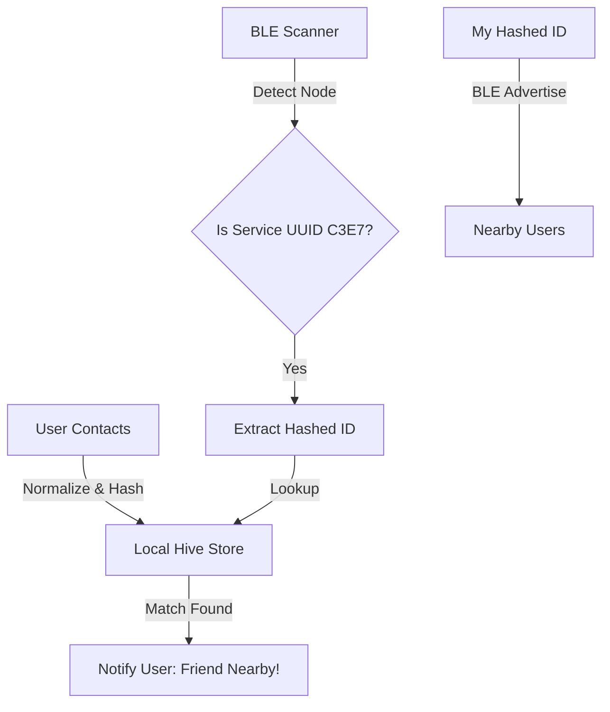

# Architecture: Checkpoint 🛰️

> A technical deep-dive into the decentralized proximity and discovery ecosystem.

---

## 🛰️ Project Goals
- **Offline First**: All discovery and matching must happen locally via Bluetooth Low Energy (BLE). No internet dependency.
- **Privacy First**: No raw personal identifiers (phone numbers, emails) are ever broadcast or shared in plain text.
- **Efficiency**: Low latency and high battery efficiency for continuous background scanning and advertising.
- **Background Execution**: Leverages Foreground Services (Android) and UIBackgroundModes (iOS) to remain active even when the app is closed.

## 🏗️ Core Components

### 🔄 P2P Radio Discovery (BLE)
Checkpoint utilizes Bluetooth Low Energy (BLE) to detect and communicate with nearby devices.
- **Service UUID**: A unique 128-bit identifier (`0000C3E7-0000-1000-8000-00805F9B34FB`) is used to identify Checkpoint nodes.
- **Advertising Mode (Peripheral)**: Devices broadcast their Presence Header, which contains their hashed identifier within the manufacturer data or service data field.
- **Scanning Mode (Central)**: Devices continuously listen for the Checkpoint Service UUID. When a node is found, its hashed ID is extracted for matching.

### 🔒 Secure Hashing & Matching
To protect user privacy, identifiers are never shared directly.
1.  **Normalization**: All contact phone numbers are normalized to E.164 format.
2.  **Hashing**: We use SHA-256 for one-way hashing of phone numbers.
3.  **Local Store**: Hashed contacts are stored in a local Hive database.
4.  **In-Memory Matching**: When a hashed ID is discovered nearby, it is compared against the local Hive database. If a match is found, the contact’s name is retrieved from the local address book.

### 💾 Local Persistence (Hive)
We use [Hive](https://pub.dev/packages/hive) for data persistence due to its speed and simplicity.
- **ContactStore**: Stores `ContactHash` objects (hashed ID, name, last seen timestamp).
- **SettingsStore**: Stores user preferences and the user’s own hashed identity.

## 📱 Mobile App Layers (Flutter)

1.  **Services Layout**:
    - `BleService`: Manages core BLE state and lifecycle (scanning/advertising).
    - `ContactService`: Handles address book permissions, hashing, and matching.
2.  **State Management**:
    - `NearbyProvider`: A centralized Store (using `Provider`) to manage the list of currently discovered contacts in the UI.
3.  **UI/Theme**:
    - `AppTheme`: A central repository for the premium dark mode colors and typography.
    - `RadarAnimation`: A custom-painted animated widget representing the proximity scanning field.

## 📡 P2C Infrastructure (Planned)
The Peer-to-Checkpoint layer will introduce:
- **Radio Mesh**: Distributed solar-powered nodes providing location anchors.
- **Hardware Pointers**: Kinetic-powered chips for long-term device recovery without primary battery power.

---

## 🛣️ Data Flow Diagram

---

  <b>Built for a decentralised and private future.</b>

